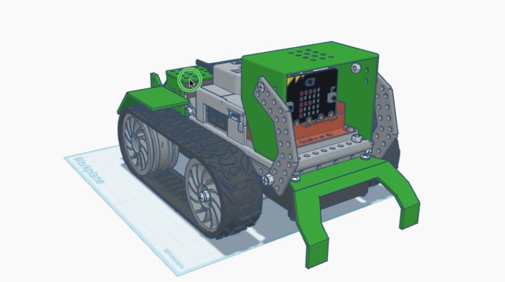

# GURO

**Kit de conversión para robots Robobloq Qoopers con [BBC Micro:bit](https://www.microbit.org)**

La Fundación Sadosky desarrolla el kit GURO para actualizar los robots Robobloq Qoopers —ya desplegados en escuelas de todo el país— reemplazando el controlador propietario Qmind Plus por la [BBC Micro:bit](https://www.microbit.org): una placa didáctica de hardware y software completamente abiertos, con una comunidad global activa de millones de docentes y estudiantes.



---

## ¿Qué es el kit GURO?

El kit GURO consiste en una **placa adaptadora** (diseño KiCad incluido en este repositorio) y un **gabinete** que permiten montar una BBC Micro:bit y una placa expansora [Kittenbot Robotbit](https://kittenbothk-eng.readthedocs.io/en/latest/Microbit_eboard/Robotbit/robotbitMC.html) en el chasis del Robobloq Qoopers, conectando los motores y sensores existentes del robot.

El resultado es un robot funcional, programable desde el navegador en bloques visuales o en Python, sin depender de ningún software propietario ni de un único proveedor.

El modelos 3D del robot y el gabinete están disponibles en este repositorio y en [Tinkercad](https://www.tinkercad.com/things/2tzfirybpMV-guro-microrbit-para-robolboq-qoopers-260401)

---

## Requisitos

- **Kit Robobloq Qoopers** — chasis, motores, sensores y partes mecánicas (sin el Qmind Plus)
- **Kit GURO** — placa adaptadora y gabinete Micro:bit (este repositorio)
- **[BBC Micro:bit](https://www.microbit.org)** v1 o v2
- Un destornillador Phillips
- Una computadora con puerto USB

---

## Guía de armado

La documentación completa está publicada en:

**[guro-tutorial.readthedocs.io](https://guro-tutorial.readthedocs.io/)**

Incluye el inventario de piezas, 16 pasos ilustrados y las instrucciones de programación. También disponible [en PDF](docs/user-guide_2026-04-01.pdf)

---

## Programación del robot

Una vez armado el GURO, cargá un programa a la Micro:bit desde el navegador, sin instalar nada:

### Opción 1 — Bloques visuales (MakeCode)

Usá el editor [Microsoft MakeCode](https://makecode.microbit.org) con la extensión **Kittenbot Robotbit** para programar el robot con bloques. [Ver instrucciones de la extensión.](https://kittenbothk-eng.readthedocs.io/en/latest/Microbit_eboard/Robotbit/robotbitMC.html)

### Opción 2 — Python

Usá el [editor oficial de MicroPython](https://python.microbit.org/v/3) de la [Micro:bit Educational Foundation](https://github.com/microbit-foundation).

El framework [**microbitML**](https://github.com/fundacion-sadosky/microbitML) (Fundación Sadosky) incluye la actividad `mbGURO`, lista para comandar al robot. Podés descargar el archivo `.hex` y bajarlo directamente a la placa.

---

## Estructura del repositorio

```
docs/               Documentación del sitio (MkDocs + Obsidian)
kit GURO/           Inventario del kit 
gabinete/           Gabinete para Micro:bit y placa expansora
placa adaptadora/   Diseño de la placa PCB adaptadora (KiCad)
scripts/            Scripts de generación de documentación
mkdocs.yml          Configuración del sitio de documentación
docs-requirements.txt  Dependencias Python para compilar la documentación
```

La carpeta `docs/` está configurada como un vault de [Obsidian](https://obsidian.md), lo que permite editarla sin usar la terminal. Ver [Contribuciones para redactores](https://guro-tutorial.readthedocs.io/contributing/for-writers/).

---

## Oportunidades de colaboración

Estas son algunas tareas concretas en las que podés contribuir al proyecto:

1. **Avistaje**: si lo usan en tu escuela, compartí la experiencia B)
1. **Completar la Mecánica**: pasar el diseño 3D del gabinete de [Tinkercad](https://www.tinkercad.com/things/2tzfirybpMV-guro-microrbit-para-robolboq-qoopers-260401) a un formato mantenible/paramétrico como openScad.
1. **Completar la Mecánica**: el capó no encaja en la tapa del gabinete.
1. **Completar la Mecánica**: la tapa del gabinete choca con el porta batería del Kittenbot.
1. **Completar la Guía**: los pasos 13, 14 y 16 de la guía de armado no tienen imágenes aún. Si tenés un kit armado, podés tomar las fotos y abrir un PR.
1. **Traducir la documentación al Inglés**: la guía de armado y el README están disponibles solo en español. Traducirlos ampliaría el alcance del proyecto a la comunidad internacional de Micro:bit.
1. **Crear una extensión de MakeCode específica para GURO**: actualmente se usa la extensión genérica de Kittenbot Robotbit. Una extensión propia simplificaría la programación en bloques con nombres y funciones adaptados al GURO.

## Contribuciones

Las contribuciones son bienvenidas, independientemente del perfil técnico.

- **Redactores y docentes**: editá la documentación con [Obsidian](https://obsidian.md) abriendo la carpeta `docs/` como vault. Ver [guía para redactores](https://guro-tutorial.readthedocs.io/contributing/for-writers/).
- **Desarrolladores**: mirá la [guía para desarrolladores](https://guro-tutorial.readthedocs.io/contributing/for-developers/).
- **Errores o sugerencias**: abrí un [issue](../../issues) en este repositorio.

---

## Créditos


Colaboradores/as iniciales, por orden alfabético:

| Nombre   | Rol                         |
|---------------------------|-----------------------------|
| Alarcón Lasagno, Ramiro   | Doc, SW, HW                 | 
| Batlle, Leandro           | Doc, SW , HW, idea original |
| Gentile Montes, Ezequiel  | Mecánica                    |
| Medel, Ricardo            | Licencias Doc, FLOSS, OSHW  |

*¿Contribuiste al proyecto? Abrí un PR para agregar tu nombre y aportes.*

Este proyecto utiliza la [BBC Micro:bit](https://www.microbit.org), desarrollada por la [Micro:bit Educational Foundation](https://github.com/microbit-foundation). La Micro:bit Foundation publica sus especificaciones de hardware, firmware y recursos educativos bajo licencias abiertas en [github.com/microbit-foundation](https://github.com/microbit-foundation).

---


## Marcas registradas

Los nombres de productos y marcas mencionados en este repositorio (incluyendo BBC Micro:bit, Robobloq, Qoopers, Kittenbot, Robotbit, Microsoft MakeCode, entre otros) son propiedad de sus respectivos titulares y se utilizan únicamente con fines identificativos y descriptivos.

## Naturaleza del proyecto

El desarrollo comenzó en la Fundación Sadosky en el marco del Programa para el Desarrollo de la Infraestructura destinada a Promover la Capacidad Emprendedora financiado por la [CAF | Banco de desarrollo de América Latina y El Caribe](https://www.caf.com/).  GURO es un kit de conversión que permite reutilizar las partes mecánicas, motores y sensores del Robobloq Qoopers con una nueva  placa controladora. El proyecto no modifica ni redistribuye el firmware, software ni diseños de hardware de los productos de terceros que integra. 

## Garantías y responsabilidad

Este proyecto se distribuye sin garantía de ningún tipo, expresa o  implícita. El armado, uso y eventual modificación del kit son responsabilidad exclusiva del usuario. Consultá las licencias GPLv3 y CC BY-SA 4.0 incluidas en este repositorio para los términos  completos. El uso del kit en entornos educativos debe realizarse bajo supervisión docente y conforme a las normativas de seguridad aplicables en cada jurisdicción. 

## Licencias

El proyecto se distribuye bajo una **licencia dual**:


### Código y diseños de hardware
Publicado bajo la [**GNU General Public License v3.0**](LICENSE) (GPLv3).
Podés usar, modificar y redistribuir el código y los diseños KiCad, siempre que cualquier obra derivada se publique bajo la misma licencia.

### Documentación
Publicada bajo [**Creative Commons Atribución-CompartirIgual 4.0 Internacional**](https://creativecommons.org/licenses/by-sa/4.0/) (CC BY-SA 4.0).
Podés copiar, adaptar y redistribuir el contenido —incluso con fines comerciales— siempre que des crédito a los autores originales y distribuyas las obras derivadas bajo la misma licencia.

---

<p align="center">
  <a href="https://www.fundacionsadosky.org.ar">Fundación Sadosky</a> &nbsp;·&nbsp;
<a href="https://program.ar">Iniciativa program.ar</a> &nbsp;·&nbsp;
  <a href="https://www.microbit.org">micro:bit</a>
</p>
