# GURO — Tutorial de armado

Esta guía explica, paso a paso, cómo armar la configuración **Estándar** del **kit GURO**.

El objetivo es transformar el robot Robobloq Qoopers en un robot funcional basado en diseños completamente abiertos. 
Utilizaremos el [BBC Micro:bit](https://www.microbit.org) como controlador en lugar del Qmind Plus original.

---

## Inventario de piezas

Antes de comenzar, distribuya todas las piezas sobre una superficie plana y verifíquelas contra la lista a continuación.

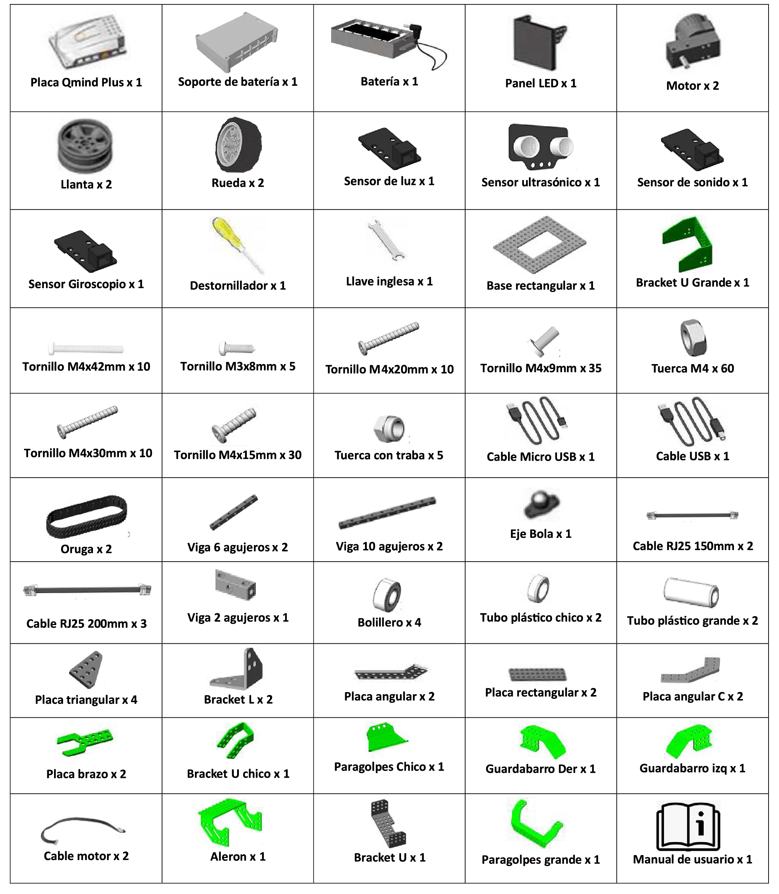

| Pieza | Cant. | Pieza | Cant. |
| --- | --- | --- | --- |
| Placa Qmind Plus | 1 | Soporte de batería | 1 |
| Batería | 1 | Panel LED | 1 |
| Motor | 2 | Llanta | 2 |
| Rueda | 2 | Sensor de luz | 1 |
| Sensor ultrasónico | 1 | Sensor de sonido | 1 |
| Sensor giroscopio | 1 | Oruga | 2 |
| Viga 6 agujeros | 2 | Viga 10 agujeros | 2 |
| Viga 2 agujeros | 1 | Base rectangular | 1 |
| Placa triangular | 4 | Placa rectangular | 2 |
| Placa angular | 2 | Placa angular C | 2 |
| Placa brazo | 2 | Bracket L | 2 |
| Bracket U grande | 1 | Bracket U chico | 1 |
| Bracket U | 1 | Bolillero | 4 |
| Eje bola | 1 | Tubo plástico chico | 2 |
| Tubo plástico grande | 2 | Paragolpes chico | 1 |
| Paragolpes grande | 1 | Guardabarro derecho | 1 |
| Guardabarro izquierdo | 1 | Alerón | 1 |
| Cable motor | 2 | Cable RJ25 150 mm | 2 |
| Cable RJ25 200 mm | 3 | Cable Micro USB | 1 |
| Cable USB | 1 | Tornillo M4×9 mm | 35 |
| Tornillo M4×15 mm | 30 | Tornillo M4×20 mm | 10 |
| Tornillo M4×30 mm | 10 | Tornillo M4×42 mm | 10 |
| Tornillo M3×8 mm | 5 | Tuerca M4 | 60 |
| Tuerca con traba | 5 | Destornillador | 1 |
| Llave inglesa | 1 | Manual de usuario | 1 |

> [!note] Sobre la placa Qmind Plus
> La placa Qmind Plus **no se utiliza** en el kit GURO: es reemplazada por el **gabinete Micro:bit**, que se arma en el Paso 11. Puede reservarla para otro proyecto, que sea soportado por la empresa Robobloq.

---

## Sección 1 — Chasis y motores

### Paso 1 — Armar el marco del chasis

**Piezas necesarias:**
- 2 × viga 10 agujeros
- 1 × viga 6 agujeros
- 2 × tornillo M4×15 mm
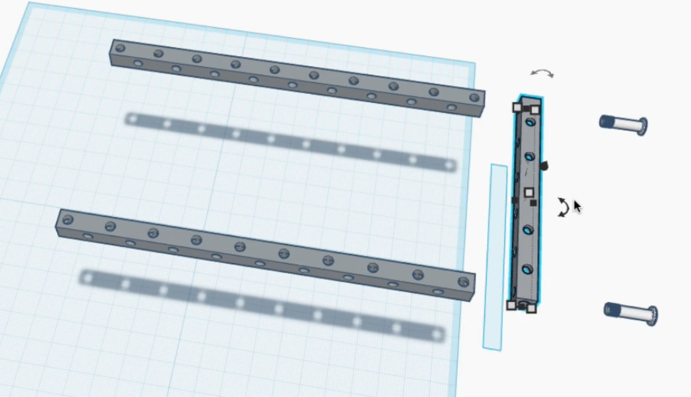

Una las dos **vigas de 10 agujeros** en paralelo, vinculándolas en sus extremos con una **viga de 6 agujeros** mediante tornillos M4×15 mm. El resultado es un marco rectangular que constituye la base del chasis. 
>[!tip] los agujeros de las vigas largas deben quedar como en el diagrama 

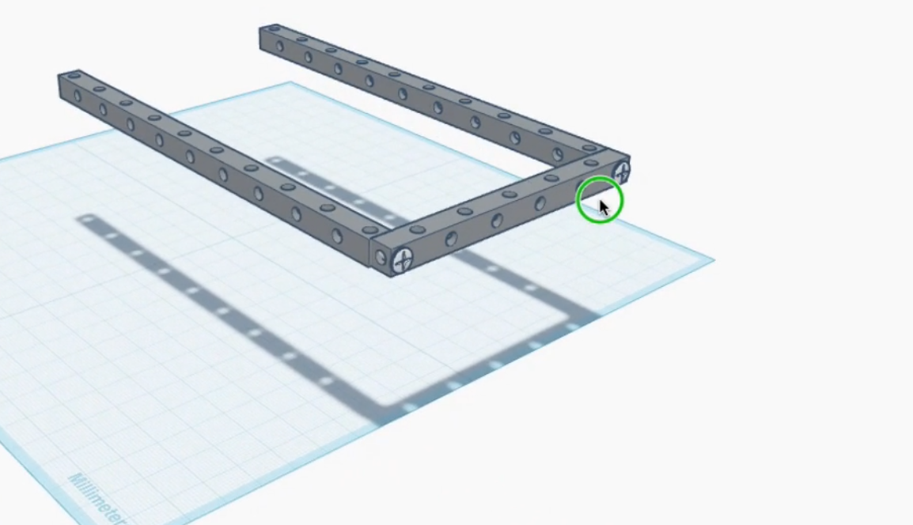

---

### Paso 2 — Montar los motores (presentando las partes)

**Piezas necesarias:**
- 2 × motor 
- 2 x llantas
- 2 × placa triangular
- 4 × tornillo M4×15 mm y sus  tuercas 
- 2 × tornillo M4×9 mm

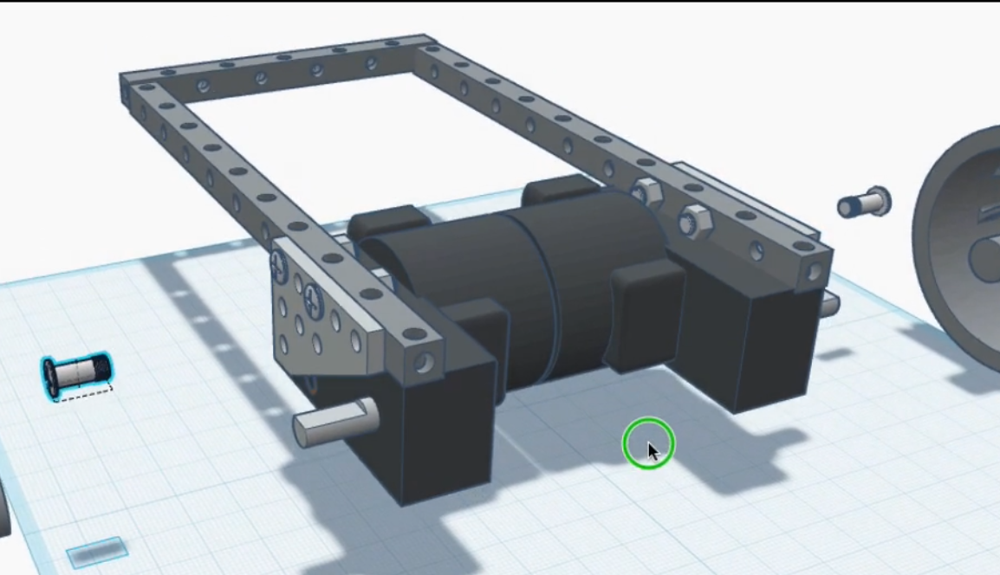
Coloque una **placa triangular** por cada extremo libre de una viga, a modo de escuadra y fije todo con dos tornillos M4×15 mm y tuercas (no muy ajustados).
Introduzca los dos **motores** dentro del marco rectangular, con el eje de salida hacia afuera, fíjelos con tornillos M4x9 mm. Vea el siguiente detalle:

El resultado es un chasis con los motores de tracción y las ruedas principales montadas. Los tornilos se mantienen flojos, y las llantas sin fijación. "Presentamos las piezas"

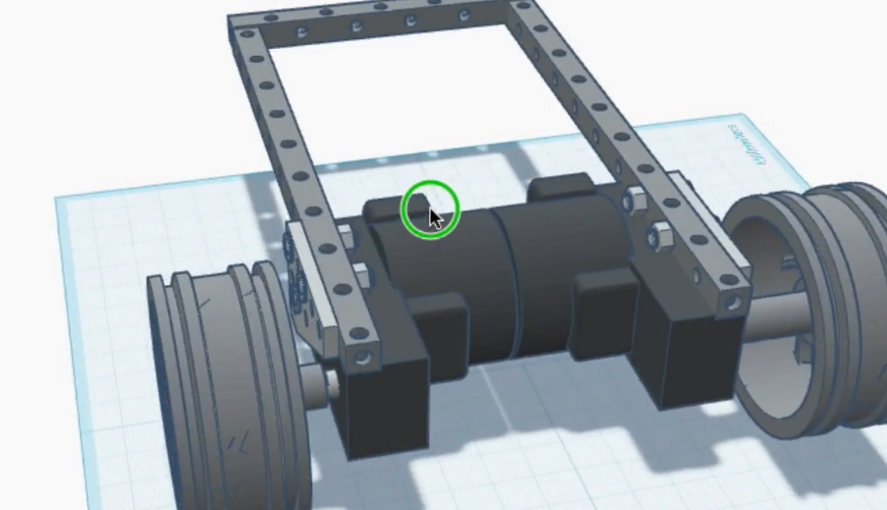

---

### Paso 3 — Montar los motores (ajustando las partes)

**Piezas necesarias:**
- 1 × placa rectangular
- 2 × tornillo M4×9 mm
- 2 x tornillo M3x8 mm

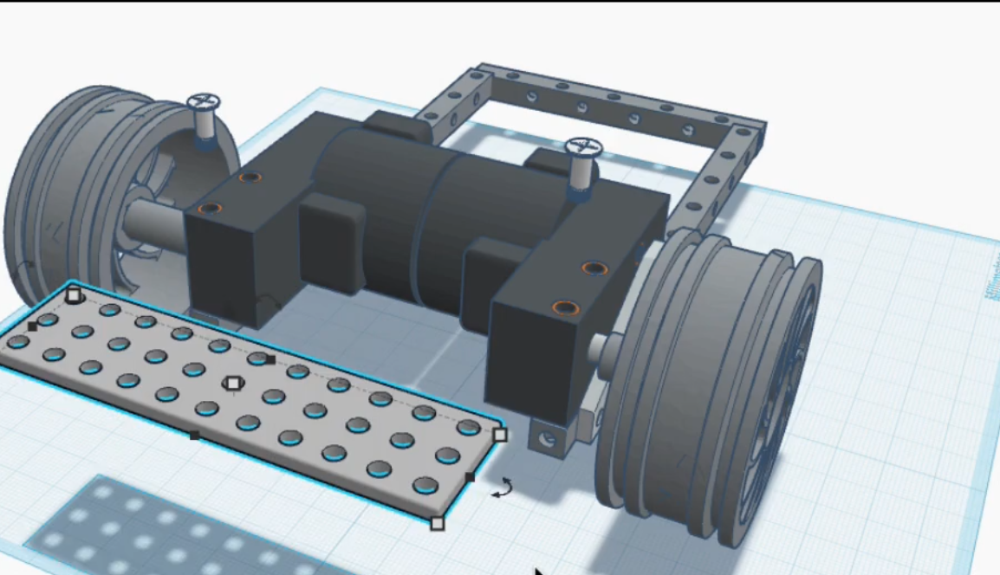

Apoye la **placa rectangular** sobre la cara **inferior** de los motores alineando los agujeros de fijación con los de los motores (**no** los del chassis). Asegúrela con 2 tornillos M4×9 mm, fuertemente apretados. Esta placa cierra la base del chasis y provee superficie de montaje para los componentes internos. Apriete los 6 tornillos de las placas triangulares (paso anterior, si es necesario saque las llantas momentáneamente). Fije las llantas con tornillos M3x8 mm

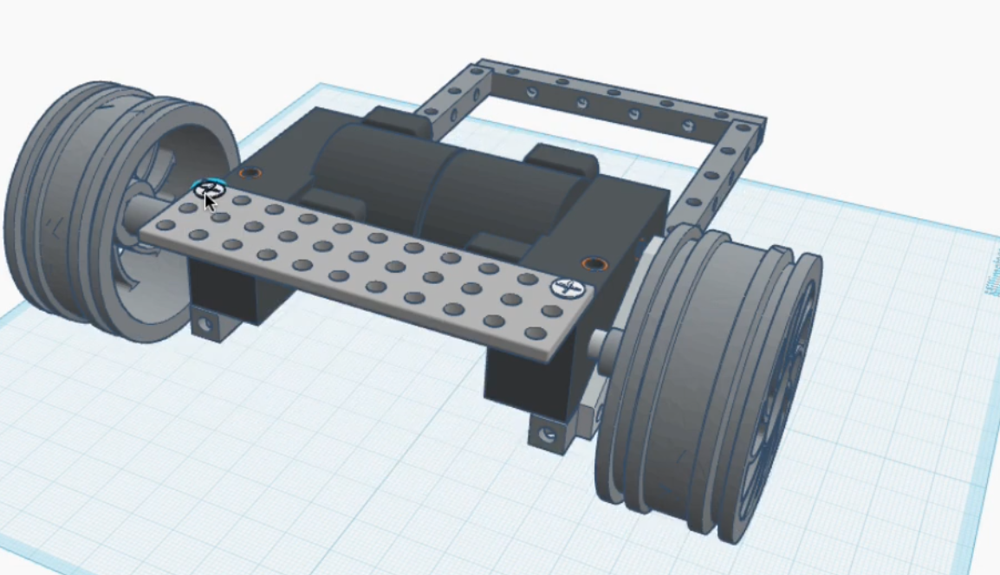

---

### Paso 4 — Completar el marco del chasis

**Piezas necesarias:**
- 1 × placa en U ("Braket U")
- 4 x tornillos M4×15 mm y sus tuercas

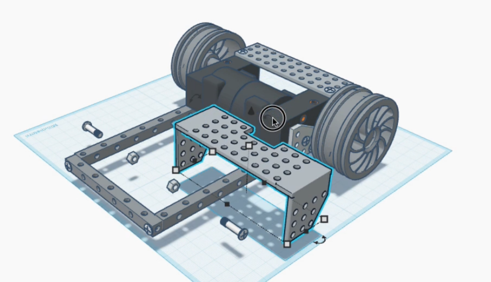

Incorpore la **placa en U**** al chasis, salteanto el primer agujero de cada viga, fijando la placa con en el segundo y tercer agujero de la viga.
El resultado es el chasis inferior completo, robusto y listo para recibir el tren de rodaje.

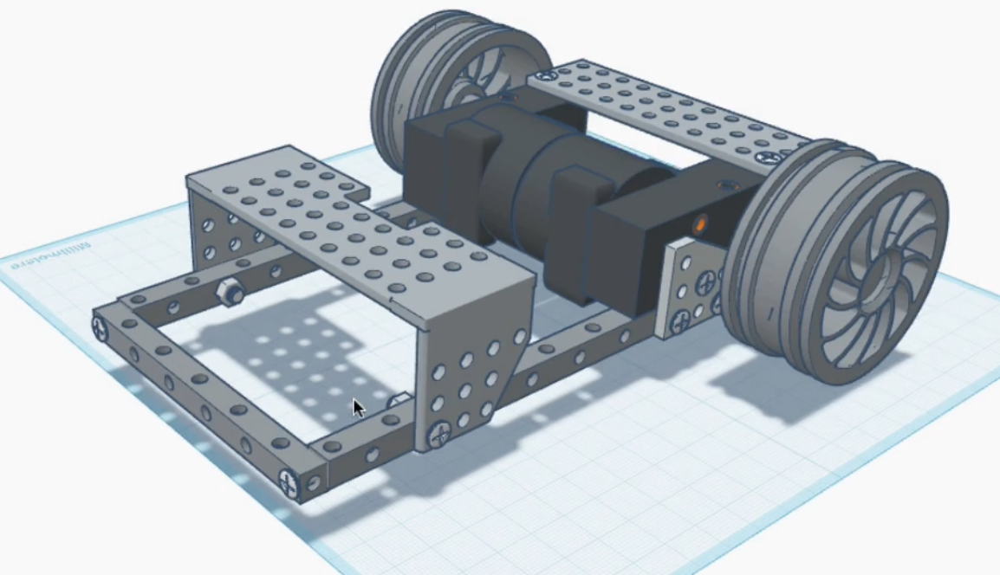

---

## Sección 2 — Ruedas, guardabarros y orugas

### Paso 5 — Montar las ruedas sin tracción

**Piezas necesarias:**
- 2 × llanta
- 4 ×  Rodamientos (conocidos como Bolilleros o Rulemanes)
- 2 × tubo plástico corto 
- 2 × tubo plástico largo (16 mm)
- 2 x tornillo M4x42mm
- 2 × tuerca con traba M4

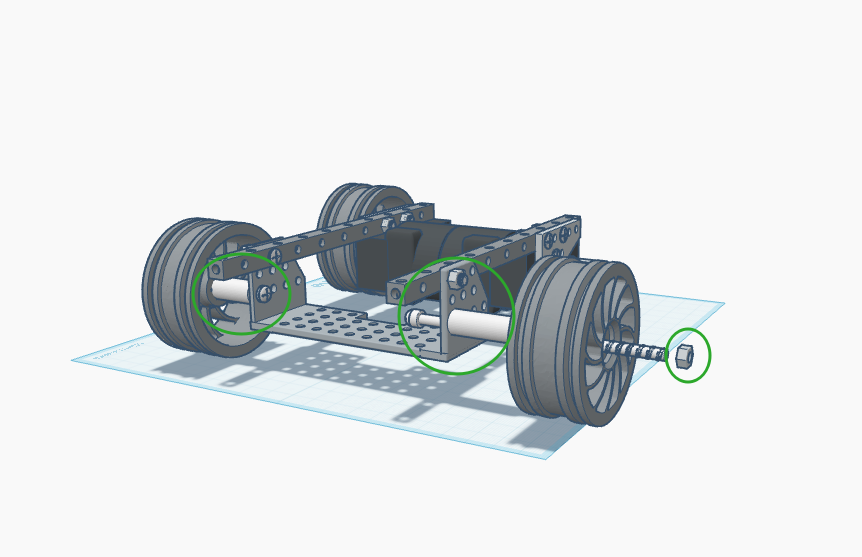

Prepare las dos llantas restantes de la siguiente manera: introduzca dos rodamientos (uno de cada lado), conun tubo chico entre medio. La llanta queda con el mismo aspecto, los rodamientos no sobresalen.

Inserte  un tornillo de M4x42 mm  (el eje) por el lado interno del chasis y  **tubo plástico largo**  por el lado externo. Inserte la rueda (conjunto rueda+rodamiento+separador+rodamiento)  en el eje y asegure con una **tuerca con traba** (no de las comunes). Repita para el lado opuesto. Estas ruedas no-motrices  deben girar libremente y guiarán las orugas.

 >[!tip] Es posible adelantar el paso 10, colocando las orugas para probar la tensión entre las ruedas. Estire cada **oruga** sobre el conjunto completo de ruedas de un mismo lateral —rueda motriz y ruedas no-motrices— de manera simultánea, distribuyendo la banda de forma pareja alrededor de todas las ruedas. No fuerce un sector a la vez. Repita para el lateral opuesto. Pruebe que las orugas se mueven con un esfuerzo mínimo.

---

### Paso 6 — Colocar los guardabarros

**Piezas necesarias:**
- 2 × guardabarro
- 4 × tornillo M4×9 mm y sus tuercas

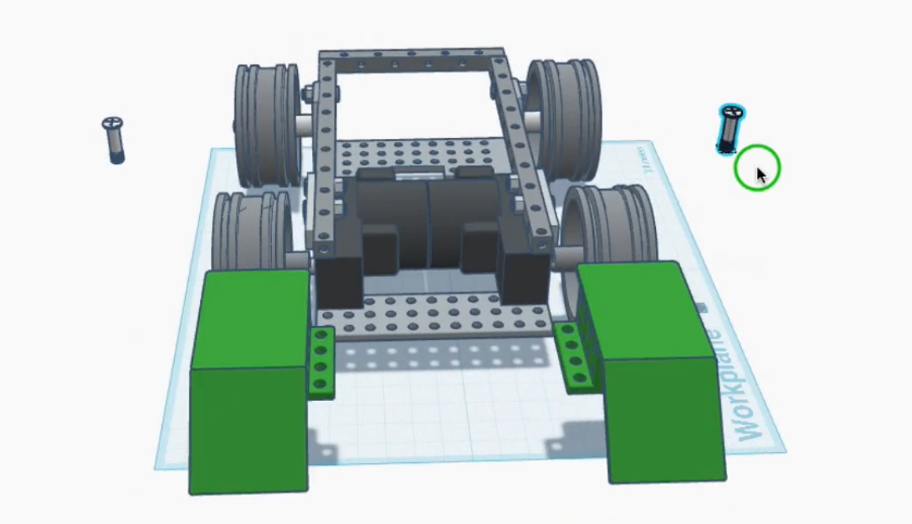

Coloque en **guardabarro** sobre el lateral del chasis, al final de la vila larga, sobre el motor. Fije cada con 2 tornillos M4×15 mm. Repita en el otro costado.
Los guardabarros otorgan a GURO protección frente a impactos y permiten colocar sensores como acelerómetro, micrófono, etc.

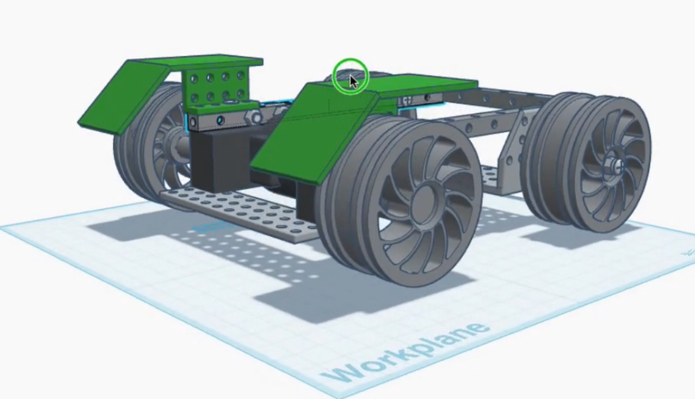

---

## Sección 3 — Carrocería

### Paso 7 — Montar la plataforma superior

**Piezas necesarias:**
- 1 × base rectangular 
- tornillos M4×15 mm

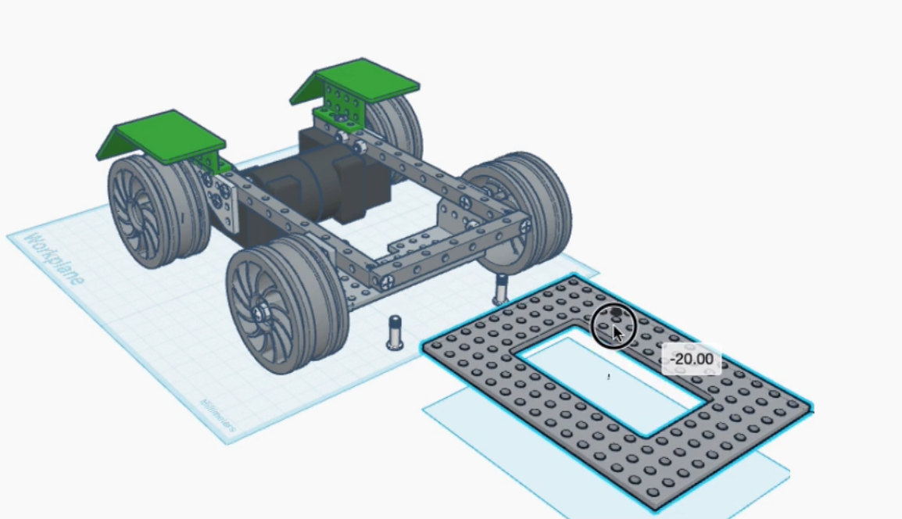

Apoye la **base rectangular** sobre las vigas laterales del chasis, alineando sus agujeros con los de las vigas, pero adelantada dos filas. Fíjela con tornillos M4×15 mm. No son necesarias tuercas, ya que la **base rectangular** presenta  agujeros roscados. 

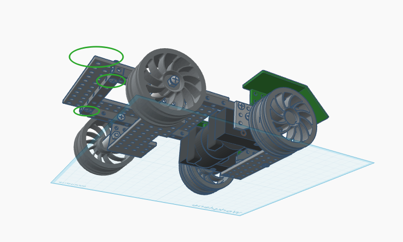
Esta plataforma es la superficie sobre la que se montan todos los componentes electrónicos, y para fijar la batería debajo (en el paso 15, por eso las dos filas adelantadas al chasis)

---

### Paso 8 — Instalar la protección del Micro:bit

**Piezas necesarias:**
- 1 × "bracket U" grande
- 2 × placa "angular C"
- 4 x tornillos M4×9 mm y sus tuercas

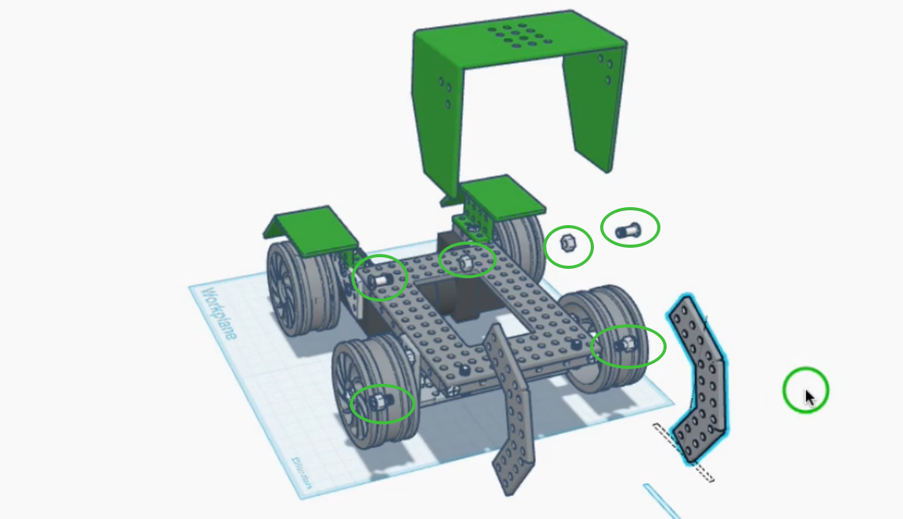

Atornille a cada costado del **"bracket U" grande**, un placa "angular C", con tornillos M4×9 mm y sus tuercas, dejándolas flojas.
Antes de atornillar las placas "angular C" al chasis, tome dos tornillos M4x9 mm y rosque a cada una, una tuerca hasta hasta que no que luz entre la tuerca y la cabeza. 
Esos ensambles tuerca+tornillo será el eje de las "angular C", atorníllelos fuertemente contra el chasos (la viga corta bajo la placa rectangular.)
Desplaze el  **"bracket U"** contra el chasis (como en la figura final) y ajuste fuertemente los 4 tornillos.

El capó protege el gabinete Micro:bit de golpes accidentales y se levantar para acceder a la electrónica.

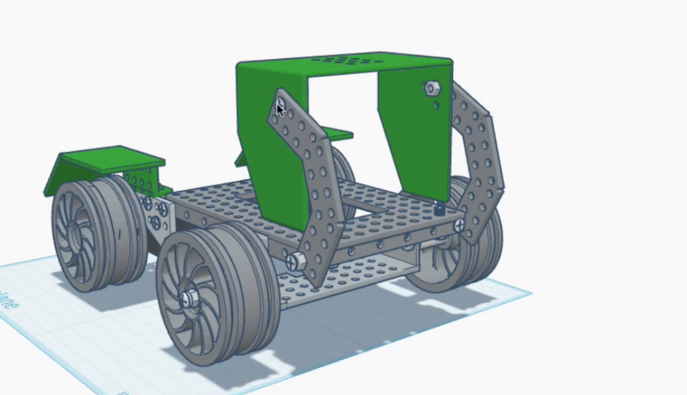

---

### Paso 9 — Armar y montar el soporte del panel LED

**Piezas necesarias:**
- 1 × panel LED
- 1 × "Braket L"
- 1 × Alerón
- 3 x tornillos M4×15 mm y sus tuercas
- 2 x tornillos M4×42 mm y sus tuerca

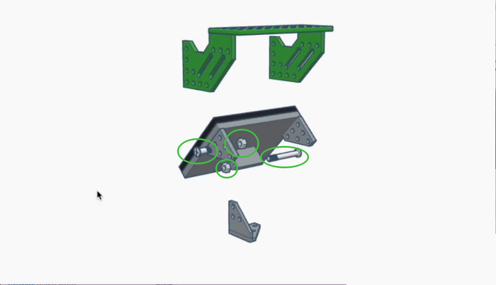
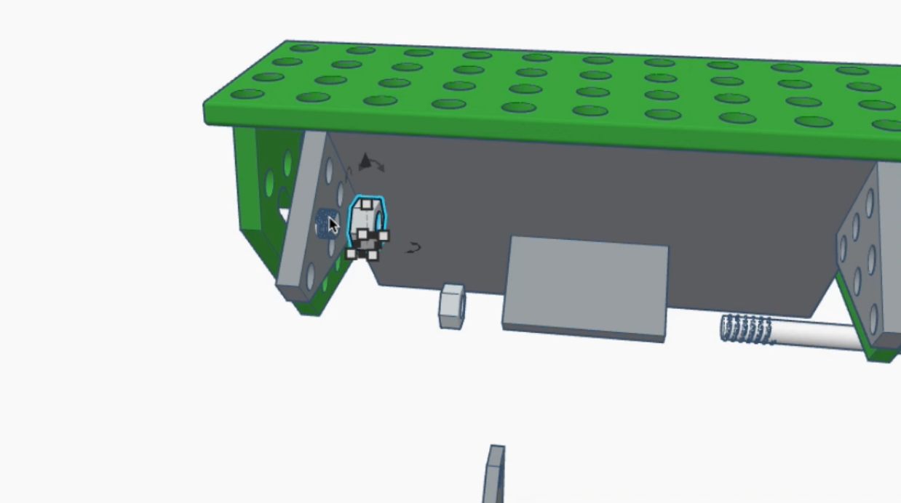
Una el **alerón** al **panel LED** con un tornillo de M4×15 mm por cada lado. Observe el agujero correspondiente del panel (gris el esquema)

La panel LED se unirá con el chasis por medio del "Braket L": un tornillo M4x42 mm con tureca con traba de lado de

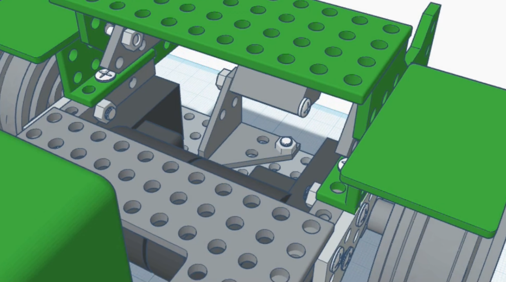
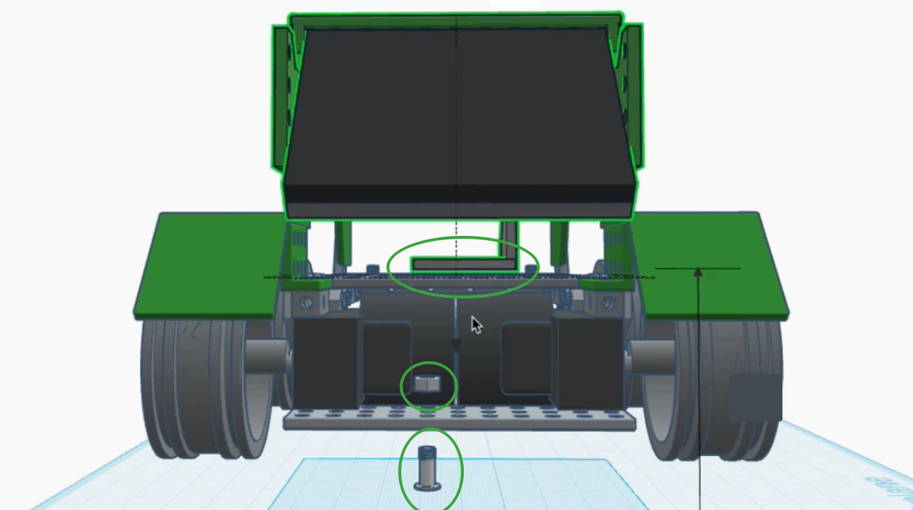

Fije el soporte completo en la parte delantera del chasis mediante el **bracket L** con un tornillo M4×9 mm. El panel LED queda orientado hacia el frente en posición levemente inclinada.

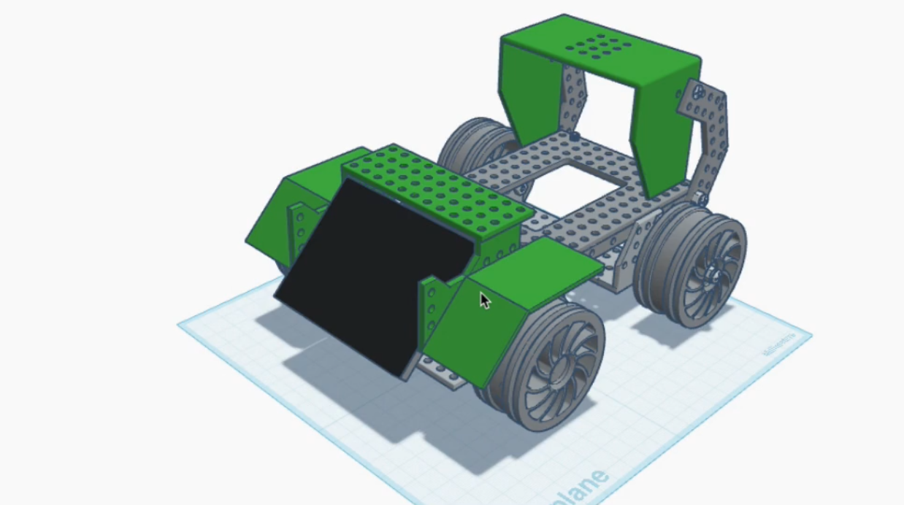

> [!tip] Orientación del panel LED
> La cara con los LEDs debe quedar mirando hacia adelante del robot. Verifique esto antes de apretar los tornillos definitivamente.

---

### Paso 10 — Colocar las orugas

**Piezas necesarias:**
- 2 × oruga (banda de goma)

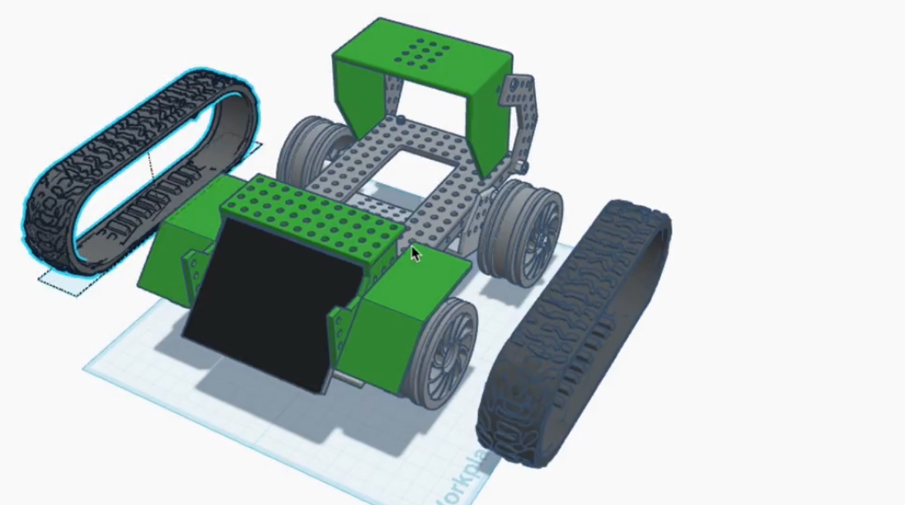

Estire cada **oruga** sobre el conjunto completo de ruedas de un mismo lateral —rueda motriz y ruedas locas— de manera simultánea, distribuyendo la banda de forma pareja alrededor de todas las ruedas. No fuerce un sector a la vez. Repita para el lateral opuesto.

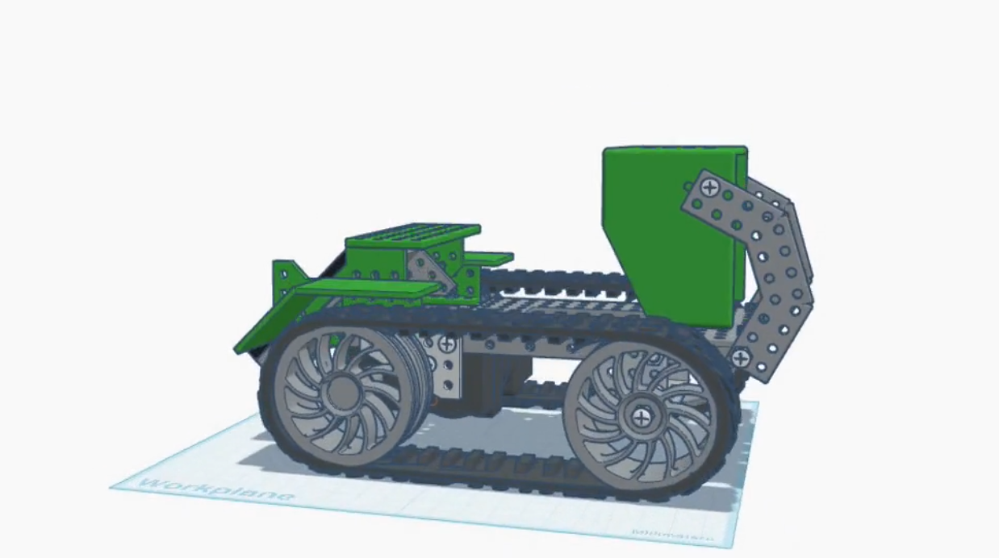

> [!tip] Verificación de tensión
>  gire cada rueda motriz a mano. La oruga debe moverse con fluidez, sin saltos ni pliegues.

---

## Sección 4 — Electrónica

### Paso 11 — Armar el gabinete Micro:bit

**Piezas necesarias:**
- 1 × placa base del gabinete
- 1 × placa expansora (carrier board)
- 1 × BBC Micro:bit
- 1 × tapa del gabinete (bracket gris)
- 4 × tornillo M3×8 mm

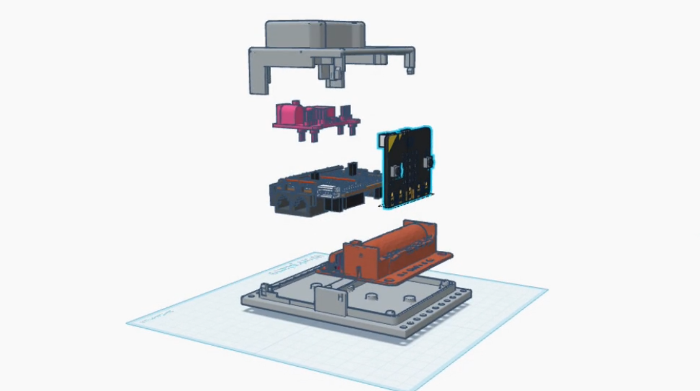

Coloque la **placa expansora** sobre la **placa base** y fíjela con tornillos M3×8 mm. Conecte el **Micro:bit** a la placa expansora encajando con cuidado el conector de borde (el lado de los pines dorados) en la ranura correspondiente. Por último, encaje la **tapa** sobre el conjunto para proteger las conexiones superiores.

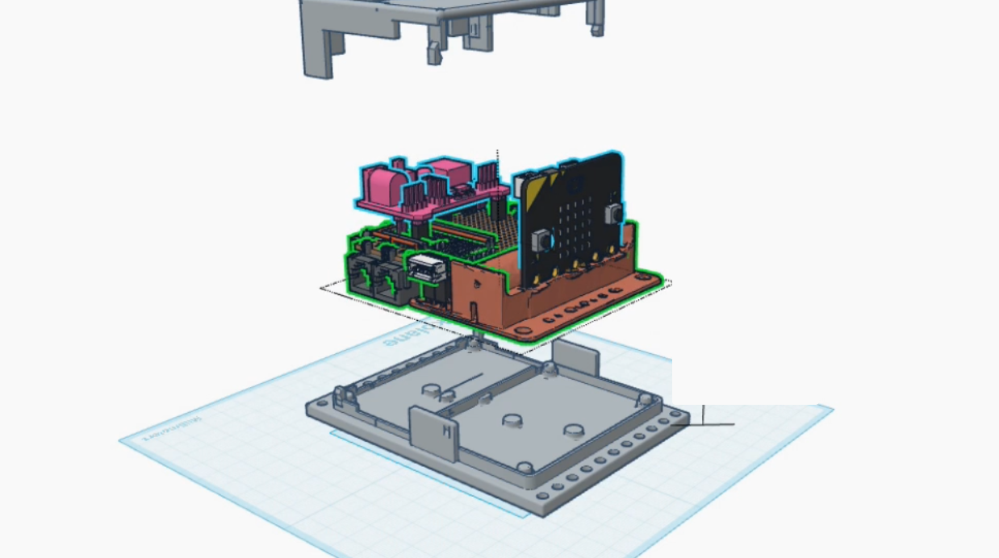

El resultado es el **gabinete Micro:bit** completo: el cerebro del GURO, listo para ser montado en el robot.

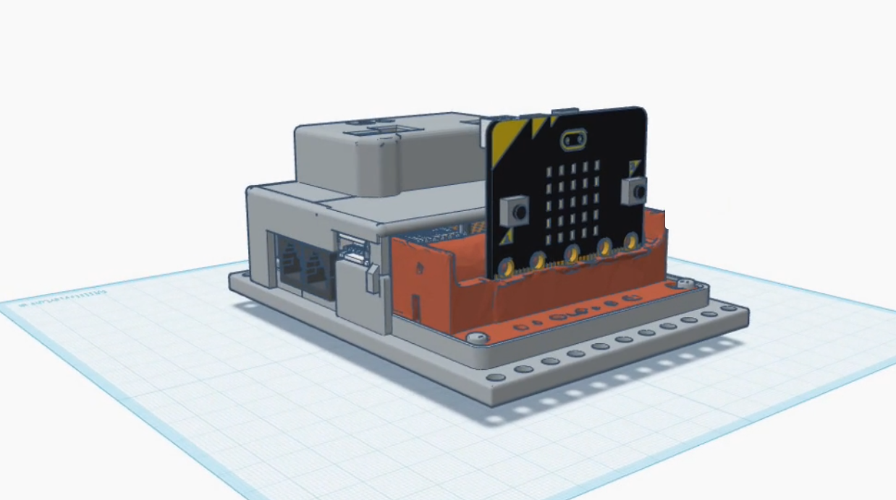

> [!note] El Micro:bit reemplaza al Qmind Plus
> El [BBC Micro:bit](https://www.microbit.org) es un microcontrolador de código y hardware completamente abiertos, con una comunidad activa de millones de usuarios en todo el mundo. Se programa de forma gratuita desde el navegador —sin instalar ningún software— en bloques visuales o en Python. A diferencia del Qmind Plus, sus especificaciones son públicas, su firmware es auditable y no depende de un único proveedor para su continuidad.

---

### Paso 12 — Montar el gabinete Micro:bit en el robot

**Piezas necesarias:**
- 1 × gabinete Micro:bit (ensamblado en el paso anterior)
- 2 × tornillo M4×9 mm
- 2 × tuerca M4

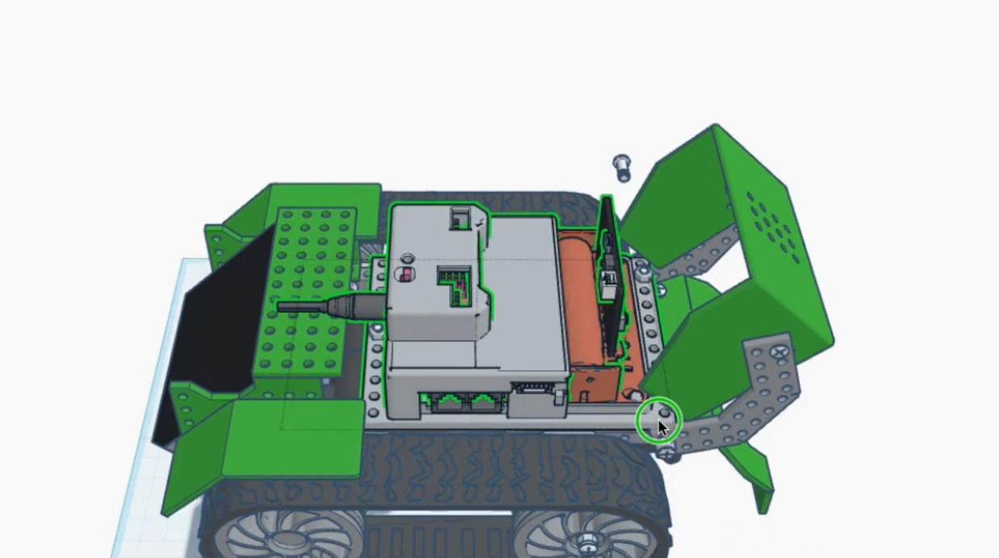

Con el capó levantado, coloque el **gabinete Micro:bit** sobre la plataforma superior del chasis, alineando los agujeros de la placa base con los de la plataforma. Fíjelo con 2 tornillos M4×9 mm y tuercas M4.

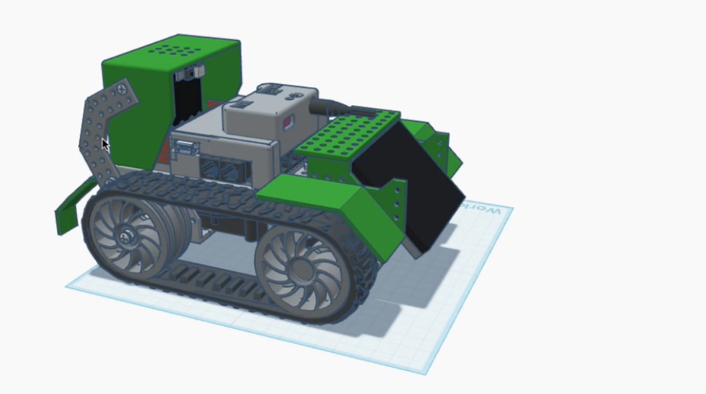

Cierre el capó. La pantalla de LEDs del Micro:bit debe quedar visible a través de la abertura delantera.

---

## Sección 5 — Cableado y batería

### Paso 13 — Conectar los motores

> [!warning] Imágenes pendientes
> Las fotografías de este paso se publicarán próximamente.

Conecte el **cable motor** de cada motor al puerto correspondiente en la placa expansora del gabinete Micro:bit. Los conectores son de 2 pines y tienen un sentido único de inserción. Cada motor cuenta con su puerto designado: izquierdo y derecho.

---

### Paso 14 — Conectar los sensores

> [!warning] Imágenes pendientes
> Las fotografías de este paso se publicarán próximamente.

Conecte cada sensor (ultrasónico, de luz, de sonido, giroscopio) a su puerto RJ25 correspondiente en la placa expansora mediante los **cables RJ25**. Utilice los cables de 150 mm para los sensores delanteros y los de 200 mm para los sensores laterales o traseros.

---

### Paso 15 — Instalar el soporte de batería y el paragolpes delantero

**Piezas necesarias:**
- 1 × **soporte de batería** (sin batería)
- 2 × tornillos M4×42 mm y sus *tuercas con traba*
- 1 x paragolpes grande

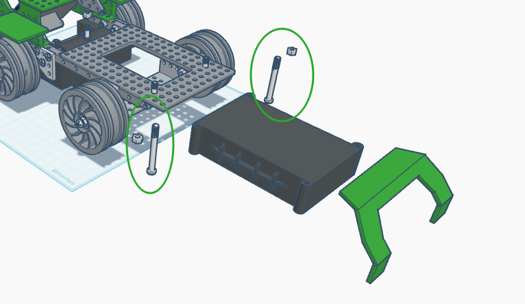

Deslice el **soporte de batería** debajo del chasis, del lado de las ruedas no-tractoras, con el hueco para el frente. Asegure el soporte y el **paragolpes grande** con un dos tornillos M4×42 mm y sus **tuercas con traba** a la primera fila de la **base rectangular** instalada en el paso 7.

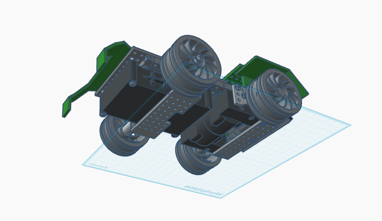

---

### Paso 16 — Conectar el panel LED

> [!warning] Imágenes pendientes
> Las fotografías de este paso se publicarán próximamente.

Conecte un **cable RJ25 de 150 mm** al puerto trasero del **panel LED**. Pase el cable por el interior del soporte y conecte el otro extremo al puerto RJ25 designado en la placa expansora.

---

## Armado completo y software de control

El GURO está listo. Conecte el robot a su computadora mediante el **cable Micro USB** y siga la guía de programación para cargar el primer programa.

Listo listo!! O casi listo... 

 El último toque que dé vida al robot GURO,  será cargarle un programa a la micro:bit. La programación cae fuera de éste documento, pero hay dos opciones convenientes:
 
1. Programar la Microbit  con bloques en el editor de [MS Makecode](https://makecode.microbit.org) con la extensión de [Kittenbot Robotbit](https://kittenbothk-eng.readthedocs.io/en/latest/Microbit_eboard/Robotbit/robotbitMC.html)   
2. Programar la Microbit con verdadero Python desde [el editor oficial](https://python.microbit.org/v/3).  El [framework microbitML](https://github.com/fundacion-sadosky/microbitML) cuenta con  la actividad `mbGURO` lista para comandar al robot GURO. Puede  descargar el archivo .HEX y subirlo al editor (o bajarlo directamente a la placa!)

