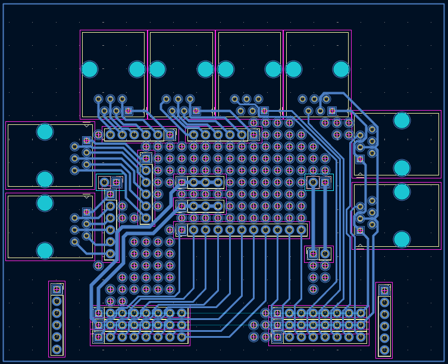

🌐 [Español](README.md)

# Adapter Board — GURO Kit

[KiCad](https://www.kicad.org/) design of the **adapter board**, a component of the [GURO kit](../kit%20GURO/README.md).

---

## What does this board do?

The adapter board is the central electrical bridge of the GURO kit.
It connects all the peripherals of the Qoopers chassis to the [Kittenbot Robotbit](https://kittenbothk-eng.readthedocs.io/en/latest/Microbit_eboard/Robotbit/robotbitMC.html):

```
Kittenbot Robotbit
      │
      ├── Motors (×2) — 6-pin connectors
      ├── sensors   ─┐
      ├── GPIO       ├── RJ25 connectors (6 Positions / 6 Contacts)
      └── LED panel ─┘
```

It also handles the connection to the kit's **power board**:

> [!WARNING]
> NEVER connect the Robobloq Qoopers battery directly to the Kittenbot Robotbit: the battery voltage must be regulated down to 5V (at 15W), which is the function of the "power board".

---

## PCB design view



The design is optimized to be **interchangeable with a [50×70 mm perfboard](https://www.printables.com/model/797008-perfboard-50x70mm-18-x-24-holes)**, allowing it to be replicated without access to professional PCB manufacturing.

---

## Manufacturing or replacement options

| Option | Difficulty | Result |
|--------|------------|--------|
| **A** — Manufacture from KiCad files | Medium — requires sending Gerbers to a manufacturer | Professional, reproducible PCB |
| **B** — 50×70 mm perfboard | Medium — requires soldering | Equivalent result, no external manufacturer |
| **C** — Direct wiring, no PCB | Low — dupont cables | Functional, less tidy |

All options yield an electrically equivalent result.

---

## Option A — Manufacture from KiCad files

The files in this folder are a [KiCad](https://www.kicad.org/) project (free and open-source PCB design software).

**To manufacture:**
1. Open the project in KiCad and export the **Gerber files** (File → Fabrication Outputs → Gerbers)
2. Upload the Gerbers to any PCB manufacturing service (JLCPCB, PCBWay, Aisler, etc.)
3. Typical order: 5 units, 2 layers, FR4, 1.6 mm thickness

**To edit the design**, you need [KiCad 7 or later](https://www.kicad.org/download/).

---

## Option B — 50×70 mm perfboard

### Components needed for soldering

| Component | Quantity | Notes |
|---|---|---|
| 50×70 mm perfboard | 1 | 2.54 mm pitch |
| Female RJ25 connector (6P6C) | 5 | For sensors and LED panel |
| Male 2-pin connector (2.54 mm pitch) | 2 | For motors |
| Female 40-pin header (2.54 mm pitch) | 2 | For Kittenbot Robotbit |
| Connection wire (wire wrap or similar) | — | For pad bridges |

### General procedure

1. Position the RJ25 connectors using the PCB layout as a reference
2. Solder the connectors and trace the bridges following the KiCad schematic
3. Verify continuity with a multimeter before connecting

---

## Option C — Direct wiring, no PCB

If you have no soldering iron or manufacturer available, it is possible to connect the peripherals directly to the Kittenbot Robotbit using **dupont cables**, without any PCB.

See [step 13 (motors)](../docs/user-guide/index.en.md) and [step 14 (sensors)](../docs/user-guide/index.en.md) of the assembly guide for connection details.

---

## Safety and License

All safety, health, and licensing terms from the [legal section of the main repository](../README.md#guarantees-and-liability) apply here, especially when soldering or handling electrical tools.
